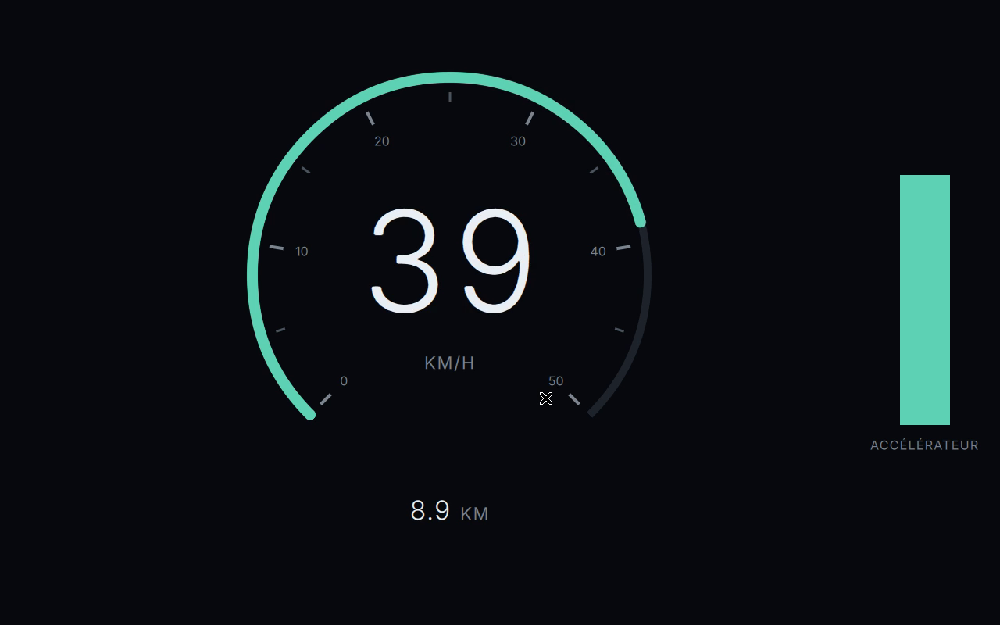

# navette-dashboard

Tableau de bord de navette électrique 8 places, en Qt 6 / QML.



[▶ Vidéo de démonstration (45 s)](docs/demo.mp4) — accélération, inertie, décélération en roue libre.

## Contexte et périmètre

Interface de conduite pour une navette électrique 8 places, destinée à un
Raspberry Pi 4 équipé d'un écran 10 pouces en 1280x800. Le projet couvre le
frontend seul : aucun backend, aucune lecture matérielle, aucun code CAN.

Les conventions de code et les règles de contribution sont dans
[`CONVENTIONS.md`](CONVENTIONS.md).

## Prérequis

**Qt 6.7 minimum** à l'exécution. Ce seuil est le maximum de deux
contraintes : `Settings` dans le module `QtCore` exige 6.5, et `font.features`
— les chiffres tabulaires, sans lesquels la valeur de vitesse saute
latéralement à chaque rafraîchissement — exige 6.7.

Il faut aussi un compilateur C++, **CMake ≥ 3.21** et **Ninja**.

Deux voies d'installation, selon ce que fournit la distribution.

### a) Paquets de la distribution — quand elle fournit Qt ≥ 6.7

| Distribution | Qt fourni | Convient ? |
|---|---|---|
| Debian 13 (Trixie) | 6.8.2 | **oui** |
| Raspberry Pi OS Trixie — la cible | 6.8.2 | **oui** |
| Debian 12 (Bookworm) | 6.4.2 | non, trop ancien |
| Ubuntu 24.04 LTS | 6.4.2 | non, trop ancien |

```sh
sudo apt install build-essential cmake ninja-build \
    qt6-base-dev qt6-declarative-dev qt6-declarative-dev-tools \
    qml-qt6 \
    qml6-module-qtcore qml6-module-qtquick qml6-module-qtquick-shapes \
    qml6-module-qtquick-window qml6-module-qttest
```

Les modules `qml6-module-*` correspondent exactement aux imports du projet :
`QtCore`, `QtQuick`, `QtQuick.Shapes`, `QtQuick.Window`, et `QtTest` pour la
suite de tests.

**Attention** — sur Debian et dérivés, les outils Qt 6 sont installés dans
`/usr/lib/qt6/bin`, qui **n'est pas dans le `PATH`**. Soit on les appelle par
leur chemin complet, soit on ajoute une fois pour toutes :

```sh
echo 'export PATH="/usr/lib/qt6/bin:$PATH"' >> ~/.bashrc   # ou ~/.zshrc
```

Avec cette voie, `CMAKE_PREFIX_PATH` est inutile : CMake trouve Qt tout seul.

```sh
cmake -S . -B build -G Ninja
```

### b) Installation isolée via aqtinstall — quand la distribution est trop ancienne

`aqtinstall` télécharge les binaires officiels de Qt dans `$HOME`, sans
toucher au système ni demander `sudo`.

```sh
sudo apt install build-essential cmake ninja-build pipx
pipx install aqtinstall
aqt install-qt linux desktop 6.8.3 linux_gcc_64 -m qtshadertools --outputdir "$HOME/Qt"
```

Environ 195 Mo de téléchargement et 1,5 Go sur disque. Le paquet de base
contient déjà `qtbase`, `qtdeclarative`, `qtsvg` et `qtwayland` ; seul
`qtshadertools` doit être demandé explicitement.

`CMAKE_PREFIX_PATH` doit alors désigner cette installation :

```sh
cmake -S . -B build -G Ninja -DCMAKE_PREFIX_PATH="$HOME/Qt/6.8.3/gcc_64"
```

C'est la voie utilisée pour développer ce projet, sur une distribution dont le
Qt système est en avance sur la cible.

## Lancement

Deux modes sont supportés en permanence. Chaque commande est donnée dans les
deux voies d'installation ; il n'y a rien à substituer.

### Raccourci — `scripts/setup.sh`

`scripts/setup.sh` détecte Qt et les outils de compilation, vérifie les
versions, puis configure et compile. Il choisit tout seul entre les deux voies
d'installation ci-dessus et n'ajoute `-DCMAKE_PREFIX_PATH` que si c'est
nécessaire.

```sh
./scripts/setup.sh                      # diagnostic, configuration, compilation
./scripts/setup.sh --run --windowed --fps
```

| Option | Effet |
|---|---|
| *(aucune)* | Diagnostic, puis configuration et compilation. **Ne lance pas** l'application : compiler et lancer sont deux intentions différentes. |
| `--check` | Diagnostic seul, ne compile rien |
| `--run` | Compile puis lance ; tous les arguments qui suivent vont à l'application |
| `--test` | Compile, puis joue `qmltestrunner` et `all_qmllint` |
| `--clean` | Supprime `build/` avant de reconfigurer ; se combine aux autres |
| `--help` | Aide |

**Le script n'installe rien et ne demande jamais les droits administrateur.**
C'est délibéré, et c'est un argument plutôt qu'une limitation : cloner un dépôt
inconnu ne devrait jamais aboutir à une invite `sudo`. Quand une dépendance
manque, il affiche la commande exacte — celle de la section Prérequis
ci-dessus — et s'arrête. À vous de décider ce qui est installé sur votre
machine. Il ne télécharge rien, ne modifie aucun profil shell, et n'écrit nulle
part ailleurs que dans `build/`.

Il fonctionne depuis n'importe quel répertoire courant, et peut être rejoué
autant de fois que voulu sans effet cumulatif.

**Ce raccourci ne remplace pas les commandes manuelles**, qui restent la
référence et sont documentées ci-dessous. Elles sont d'ailleurs ce que le
script exécute : rien n'oblige à lui faire confiance sur parole.

### Mode 1 — build CMake, le mode de production

**Qt de la distribution** (voie a) — CMake trouve Qt tout seul :

```sh
cmake -S . -B build -G Ninja
cmake --build build
./build/dashboard
```

**Qt via aqtinstall** (voie b) :

```sh
cmake -S . -B build -G Ninja -DCMAKE_PREFIX_PATH="$HOME/Qt/6.8.3/gcc_64"
cmake --build build
./build/dashboard
```

Le binaire produit est identique dans les deux cas : seule la configuration
diffère.

### Mode 2 — runtime QML, pour itérer sans compiler

**Qt de la distribution** (voie a) :

```sh
/usr/lib/qt6/bin/qml src/Main.qml
```

**Qt via aqtinstall** (voie b) :

```sh
"$HOME/Qt/6.8.3/gcc_64/bin/qml" src/Main.qml
```

Sur une machine sans affichage, préfixer par `QT_QPA_PLATFORM=offscreen`.

### Options de lancement

Les deux drapeaux suivent le même principe : **le défaut correspond au
produit**, et c'est le développement qui demande une option.

| Drapeau | Effet |
|---|---|
| `--windowed` | Démarre en fenêtre au lieu du plein écran |
| `--fps` | Affiche le compteur d'images par seconde en haut à droite |

L'application démarre **en plein écran sans décoration**, ce qui est le mode
de déploiement réel : sur le Raspberry Pi il n'y a pas de gestionnaire de
fenêtres, la fenêtre doit occuper l'écran. La touche **Échap** en sort à
chaud.

Le compteur de FPS est un instrument de mise au point : il sert à mesurer sur
la cible et à démontrer la fluidité dans la vidéo de démonstration, pas à
meubler un combiné de conduite. Il est donc absent par défaut, et l'animation
qui l'alimente ne tourne pas quand il n'est pas affiché.

En mode 1, les drapeaux se passent directement, quelle que soit la voie
d'installation :

```sh
./build/dashboard --windowed --fps
```

En mode 2, le `--` est nécessaire, sans quoi l'outil `qml` prend l'option pour
un second fichier à charger.

```sh
# Qt de la distribution (voie a)
/usr/lib/qt6/bin/qml src/Main.qml -- --windowed --fps

# Qt via aqtinstall (voie b)
"$HOME/Qt/6.8.3/gcc_64/bin/qml" src/Main.qml -- --windowed --fps
```

### Commande

L'organe de commande est la **jauge d'accélérateur** à droite de l'écran. Elle
s'utilise en maintenant l'appui : la position du doigt ou du curseur dans la
barre fixe l'accélération, et le glisser vertical la fait varier en continu.

**Le relâchement ramène immédiatement à zéro, comme une pédale.** C'est ce qui
produit la roue libre : le véhicule décélère alors selon `COAST_DECEL_MS2`.
Un appui relâché aussitôt ne produit donc qu'une impulsion, sans effet visible
— il n'existe pas de clic qui positionnerait durablement la commande.

La **flèche haut** du clavier est un appoint, utile pour conduire d'une main
pendant l'enregistrement d'une démonstration. Elle est automatiquement
suspendue pendant une action sur la jauge, pour que les deux organes ne se
disputent pas la commande.

## Architecture

Découpage entre la couche de données simulées et la couche d'affichage, cette
dernière ne faisant que lire et lisser des propriétés.

| Fichier | Rôle |
|---|---|
| `src/main.cpp` | Point d'entrée. Instancie le moteur QML et charge le module. Aucune logique applicative. |
| `src/VehicleModel.js` | Modèle physique pur, sans état ni effet de bord. Testable seul. |
| `src/SimulatedDataSource.qml` | Source de données. Publie le contrat, intègre le modèle à 20 Hz. |
| `src/OdometerStorage.qml` | Persistance de l'odomètre, isolée derrière un `Loader`. |
| `src/Theme.js` | Tokens de design. Source unique de toute valeur visuelle. |
| `src/SpeedDial.qml` | Cadran de vitesse. Ne connaît ni la source ni la physique. |
| `src/ThrottleGauge.qml` | Jauge d'accélérateur interactive. Bidirectionnelle : affiche une valeur, émet un signal. |
| `src/Odometer.qml` | Kilométrage cumulatif. |
| `src/Main.qml` | Fenêtre principale. Compose les composants et câble la source. |
| `assets/fonts/` | Police Inter (OFL), embarquée dans le binaire. |

Le langage visuel — couleurs, typographie, espacement, durées, contraintes GPU
— est spécifié dans [`DESIGN.md`](DESIGN.md), qui fait autorité.
Aucune valeur visuelle ne doit apparaître en dur dans un composant : tout passe
par `src/Theme.js`.

### Police

Inter, sous licence OFL, est **embarquée dans le binaire** plutôt que prise sur
le système : le rendu doit être identique sur le Pi et sur la machine de
développement. Deux graisses statiques sont fournies, Light (300) et Regular
(400), chargées par `FontLoader` et enregistrées sous la même famille `Inter`.

L'affichage ne calcule jamais de physique : il lit les sorties de la source et
les lisse via `Behavior`. Cette règle est ce qui rend l'affichage indépendant
de la cadence — et donc interchangeable entre source simulée et source réelle.

## Structure des données simulées

Le contrat se lit en **deux parties distinctes**. C'est le point central de la
conception, et ce qui rend le passage au CAN réel indolore.

### Sorties — communes à toute source

Seules propriétés que l'affichage a le droit de lire. Toute source, simulée ou
réelle, doit les fournir.

| Champ | Type | Plage | Unité | Sens |
|---|---|---|---|---|
| `speedKph` | `real` | 0 à `maxSpeedKph` | km/h | lecture seule |
| `maxSpeedKph` | `real` | > 0 | km/h | lecture seule, constante pour une source donnée |
| `odometerKm` | `real` | ≥ 0 | km | lecture seule, monotone croissant |
| `throttlePercent` | `real` | 0 à 100 | % | lecture seule |
| `sourceValid` | `bool` | — | — | lecture seule, `false` si la source est défaillante |

`maxSpeedKph` fait partie du contrat, et non de l'affichage. La raison est la
même que pour le reste : **un bus CAN définit aussi la plage de ses signaux**,
pas seulement leur valeur courante. La borne d'échelle appartient donc à la
source qui publie la grandeur, pas au cadran qui la dessine.

Concrètement, cela supprime une duplication : la vitesse maximale était écrite
à deux endroits — `MAX_SPEED_KPH` dans `VehicleModel.js` et la valeur par
défaut de `maxSpeedKph` dans `SpeedDial.qml` — sans rien pour garantir qu'elles
restent d'accord. `SimulatedDataSource` publie désormais celle du modèle, et
`Main.qml` la câble sur le cadran. `SpeedDial` conserve sa valeur par défaut,
qui ne sert plus qu'à le garder utilisable seul, en isolation ou dans un test :
il n'importe toujours pas la physique.

### Entrée de simulation — propre au simulateur

| Champ | Type | Plage | Unité | Sens |
|---|---|---|---|---|
| `throttleInput` | `real` | 0 à 100 | % | **écriture** par l'IHM |

Sur véhicule réel, la position de pédale provient du VCU via le bus CAN :
l'IHM ne la produit pas, elle la subit. `throttleInput` est donc le point
d'injection propre au simulateur. Il **disparaît** au passage au CAN, sans que
l'affichage change d'une ligne — puisque l'affichage ne lit que les sorties.

### Champ réservé, non implémenté

| Champ | Type | Plage | Unité | Statut |
|---|---|---|---|---|
| `brakePercent` | `real` | 0 à 100 | % | **réservé, non implémenté** |

Le freinage actif relève du Groupe III. L'énoncé ne demande que la
décélération en roue libre, qui est modélisée par `COAST_DECEL_MS2`.

### Cadence : 20 Hz

La source publie toutes les **50 ms**, soit 20 Hz.

Ce choix est structurel, pas esthétique. Une trame CAN périodique de vitesse
tourne typiquement entre 10 et 100 Hz ; 20 Hz est réaliste pour ce type de
véhicule. En publiant dès maintenant à cette cadence, on garantit que
l'affichage est conçu pour une source **lente et discrète**, et non pour une
animation continue. Le rendu tourne à la fréquence de l'écran — 60 Hz sur la
cible, davantage sur une machine de développement — pendant que la source
publie à 20 Hz : c'est `Behavior`, côté affichage, qui interpole entre deux
trames. La démonstration que le rendu ne dépend pas de la cadence de la source
est ainsi faite par construction.

L'écriture de l'odomètre sur disque est délibérément découplée : **0,2 Hz**
(toutes les 5 s) au lieu de 20 Hz, pour ménager la carte SD du Raspberry Pi.
Le compromis est qu'une coupure brutale peut perdre jusqu'à 5 s de trajet, ce
qui est sans conséquence sur un odomètre.

## Modèle physique

Tout est dans `src/VehicleModel.js`. Le modèle travaille en m/s en interne et
n'expose que des km/h, pour que les constantes restent lisibles en SI.

| Constante | Valeur | Unité | Origine |
|---|---|---|---|
| `MAX_SPEED_KPH` | 50 | km/h | Navette urbaine à carrosserie ouverte : vitesse bridée bien en dessous d'un véhicule routier, les passagers pouvant voyager debout. |
| `MAX_ACCEL_MS2` | 1,5 | m/s² | Véhicule 8 places chargé, annoncé à ~0-50 km/h en 12 s, soit une moyenne de (50/3,6)/12 ≈ 1,16 m/s². L'accélération décroissant avec la vitesse, la consigne à l'arrêt doit être supérieure à cette moyenne : 1,5 restitue les 12 s. |
| `COAST_DECEL_MS2` | 0,4 | m/s² | Résistance au roulement + traînée aérodynamique. Pas de frein moteur ni de récupération : la chaîne de traction est supposée en roue libre pédale relâchée. |

**Accélération** — approche asymptotique :

```
a = (throttle / 100) × MAX_ACCEL_MS2 × (1 − v / vMax)
```

L'accélération disponible décroît linéairement jusqu'à s'annuler à `vMax`. La
vitesse tend vers son plafond au lieu d'y buter brutalement, ce qui donne un
comportement de fin de course réaliste sur un cadran.

**Décélération** — pédale relâchée : `a = −COAST_DECEL_MS2`, constante jusqu'à
l'arrêt.

**Invariants garantis** : la vitesse n'est jamais négative et ne dépasse
jamais `MAX_SPEED_KPH` ; l'odomètre ne décroît jamais. L'odomètre est intégré
par la méthode des trapèzes, exacte lorsque l'accélération est constante.

`step(state, dt)` est **pure** : elle ne modifie pas son argument et retourne
un nouvel objet. `throttlePercent` est un champ de `state` plutôt qu'un
troisième paramètre, ce qui préserve la signature d'un intégrateur générique
et regroupe en un seul objet tout ce qui décrit l'instant courant.

## Passage aux données CAN réelles

Cette section est **de la documentation**. Aucun code CAN n'existe dans ce
dépôt et il n'est pas prévu d'en écrire ici.

Le détail — trames proposées, encodage octet par octet, détection de défaut et
procédure de substitution pas à pas — est dans
[`docs/interface-can.md`](docs/interface-can.md). Ce document est une
**proposition émise par l'équipe frontend**, à valider avec l'équipe firmware
(Groupe III) : les identifiants, l'encodage et les périodes y sont inventés
faute de connaître le format de trames réel.

La procédure pour **éprouver** cette proposition sur un bus CAN virtuel
(`vcan`) est dans [`docs/validation-can.md`](docs/validation-can.md) : mise en
place du bus, vérification de l'encodage jouable dès aujourd'hui sans aucun
code d'application, tests de la future source CAN, protocole d'intégration
conjointe avec le Groupe III, et limites de l'approche.

### Ce qu'il y aurait à remplacer

Un seul fichier : `src/SimulatedDataSource.qml`, à substituer par un
`CanDataSource` qui publierait **les mêmes cinq sorties**.

| Élément actuel | Devient |
|---|---|
| `Timer` à 50 ms appelant `VehicleModel.step()` | Réception des trames CAN périodiques |
| `throttleInput` (écriture IHM) | **Disparaît** — la pédale vient du VCU |
| `throttlePercent` calculé depuis `throttleInput` | Décodé depuis la trame VCU |
| `speedKph` intégré localement | Décodé depuis la trame de vitesse |
| `maxSpeedKph` = `VehicleModel.MAX_SPEED_KPH` | Borne haute déclarée par la base de signaux (fichier DBC), ou bridage du VCU |
| `odometerKm` intégré localement | Décodé, ou toujours intégré si le bus ne le publie pas |
| `sourceValid` = `_tick.running` | Watchdog sur l'âge de la dernière trame, compteur de séquence, CRC |

`_private.faulted` existe déjà dans `SimulatedDataSource` comme point
d'accroche pour cette détection de panne, précisément pour que l'ajouter plus
tard ne touche ni la propriété `sourceValid` ni l'affichage.

### Ce qu'il n'y aurait PAS à toucher

- **Tout l'affichage.** Aucun composant visuel ne lit `throttleInput` : le
  cadran lit `speedKph` et `maxSpeedKph`, la jauge lit `throttlePercent`,
  l'odomètre lit `odometerKm`, l'indicateur de défaut lit `sourceValid`. Seul
  `Main.qml`, qui câble les composants entre eux, écrit dans `throttleInput` —
  et c'est précisément cette ligne de câblage qui disparaîtrait.
- **`VehicleModel.js`** — soit il devient inutile si le bus publie la vitesse,
  soit il reste tel quel pour intégrer l'odomètre. Dans les deux cas il n'est
  pas modifié.
- **`OdometerStorage.qml`** — la persistance est indépendante de l'origine des
  données.
- **`main.cpp`**, **`CMakeLists.txt`** (hors ajout du nouveau fichier), et la
  totalité des tests du modèle physique.

C'est la raison d'être de la séparation sorties / entrée de simulation : la
frontière de substitution est un fichier, pas une refonte.

## Tests

Tests QML exécutés par `qmltestrunner`, complétés par le lint `qmllint` qui
doit passer sans aucun avertissement.

**Qt de la distribution** (voie a) :

```sh
/usr/lib/qt6/bin/qmltestrunner -input tests
cmake --build build --target all_qmllint
```

**Qt via aqtinstall** (voie b) :

```sh
"$HOME/Qt/6.8.3/gcc_64/bin/qmltestrunner" -input tests
cmake --build build --target all_qmllint
```

`all_qmllint` est une cible du build : elle utilise le `qmllint` de
l'installation Qt trouvée par CMake, sans chemin à préciser.

Sur une machine sans affichage, préfixer `qmltestrunner` par
`QT_QPA_PLATFORM=offscreen`.

| Fichier | Ce qu'il verrouille |
|---|---|
| `tests/tst_vehiclemodel.qml` | Le **modèle physique seul**, jamais l'IHM : saturation sous plein gaz, arrêt exact à zéro en roue libre, monotonie de l'odomètre, indépendance au pas de temps, pureté de `step()`. |
| `tests/tst_speeddial.qml` | Le cadran sature exactement au plafond qu'on lui donne, quel qu'il soit ; les graduations suivent ce plafond ; le plafond publié par la source est bien celui du modèle. |
| `tests/tst_throttlegauge.qml` | La jauge suit sa propriété `value`, y compris sur des variations rapprochées, et borne les valeurs hors plage. |

Le lint et les tests couvrent des risques différents : `qmllint` attrape les
erreurs de typage et de liaison à l'écriture, les tests attrapent les
régressions de comportement. Les deux sont exigés sans exception.

L'exécution des tests affiche une ligne
`QML OdometerStorage: Failed to initialize QSettings instance`. Ce n'est pas
un échec : `qmltestrunner` ne définit pas d'identité d'application, donc
`QSettings` refuse de s'initialiser et la persistance de l'odomètre se dégrade
à zéro — exactement le repli prévu par le `Loader`. La ligne est la preuve
visible que ce repli fonctionne.

## Limites connues

- Le freinage actif (`brakePercent`) n'est pas implémenté.
- Aucune détection de panne de la source n'est implémentée ; `sourceValid`
  reflète seulement l'état du timer, et l'indicateur « SOURCE INVALIDE »
  n'apparaît donc jamais en fonctionnement normal. Le point d'accroche pour
  un watchdog est en place (`_private.faulted`).
- L'intégration de la vitesse est un Euler explicite, d'erreur en O(dt).
  L'écart entre `dt = 0,05` et `dt = 0,01` sur 10 s est de 0,12 % — acceptable
  pour un affichage, à revoir si le modèle devait servir à autre chose.
- Les deux graisses statiques d'Inter sont produites par instanciation de la
  police variable officielle (`fontTools varLib.instancer`, axes `wght` et
  `opsz` figés), l'archive de distribution statique n'ayant pas pu être
  téléchargée dans un délai raisonnable. Le résultat est équivalent et reste
  sous licence OFL, dont le texte est fourni dans `assets/fonts/OFL.txt`.
- La fluidité n'a **pas** été mesurée sur la cible : le compteur de FPS relève
  la fréquence de l'écran de développement, pas la marge disponible sur un
  Raspberry Pi 4. Le seuil de 55 FPS du §5 de `DESIGN.md` reste à vérifier sur
  matériel réel.
